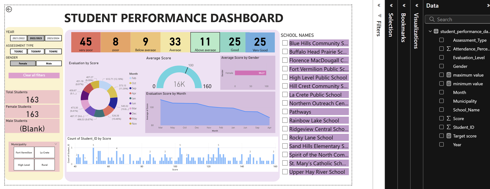

# Student Performance Analysis System

This project analyzes student academic performance using Python, SQL, and Power BI.

## Tools Used
Python
SQL
Power BI

## Key Analysis
Student average marks
Attendance vs performance
Top performing students
Gender based performance comparison

## Dashboard Preview

## Project Structure
Student-Performance-Analysis
│
├── students_data.xlsx
├── data_analysis.py
├── sql_query_studentperformance.sql
├── student_performance_dashboard.pbix
├── dashboard.png
└── README.md

## Author
Umang Singh
